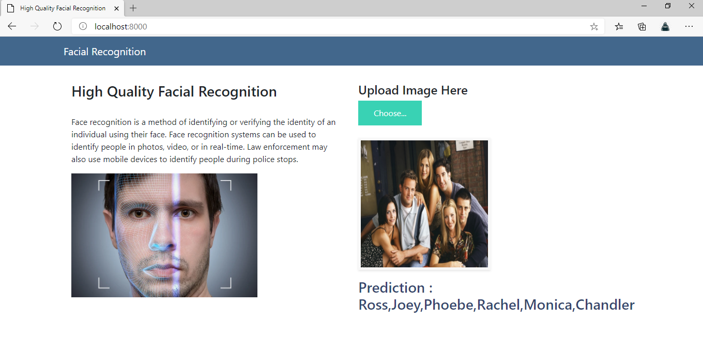
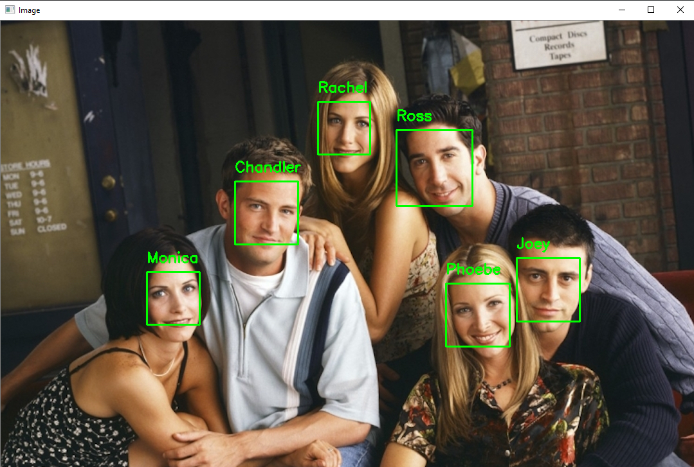

# The-One-With-Facial-Recognition
## Overview
<b>Facial recognition</b> is the process of identifying or verifying the identity of a person using their face. It captures, analyses, and compares patterns based on the person's facial details. High-Quality Facial Recognition System has many applications starting from mobile phones to security cameras. The face detection process is an essential step as it detects and locates human faces in images and videos.

In this project, we are going to build a Facial Recognition application that can detect faces of the core characters of the 90's sitcom <b>F.R.I.E.N.D.S</b> and recognize them. We are going to build this using <b>dlib</b> which uses <b>128 points face detectors</b> which outputs these 128 points from all the faces and compares them with existing faces.

## Prior Knowledge
Before we get started, make sure you have a dictionary understanding of following concepts:
<ul>
  <li>Python Basics</li>
  <li>OpenCV</li>
  <li>Euclidean Distance</li>
  <li>Basic understanding of image properties</li>
  <li>Command Line Arguments</li>
  <li>Neural Networks</li>
 </ul>
 
<b>BONUS</b>: Click <a href="https://www.youtube.com/watch?v=kdLM6AOd2vc&list=PLS1QulWo1RIa7D1O6skqDQ-JZ1GGHKK-K">here</a> to learn about OpenCV in great detail.
 
 ## Requirements
 <ul>
  <li><b>PC</b>: Windows 7 or higher with the latest updates installed.</li>
  <li><b>Visual Studio</b>: https://visualstudio.microsoft.com/downloads/</li>
  <li><b>Python</b>: https://www.python.org/downloads/</li>
  <li><b>Anaconda</b>: https://www.anaconda.com/downloads</li>
  <li><b>Notepad++</b>: https://notepad-plus-plus.org/downloads/</li>
  <li><b>Numpy</b>: https://numpy.org/install/</li>
  <li><b>Pandas</b>: https://pandas.pydata.org/pandas-docs/stable/getting_started/install.html </li>
  <li><b>Opencv-python (CV2)</b>: https://pypi.org/project/opencv-python/ </li>
  <li><b>Imutils</b>: https://pypi.org/project/imutils/ </li>
  <li><b>Argparse</b>: https://pypi.org/project/argparse/</li>
  <li><b>Dlib</b>: https://pypi.org/project/dlib/</li>
  <li><b>Tensorflow</b>: https://www.tensorflow.org/install</li>
  <li><b>Tensorflow GPU</b>: https://www.tensorflow.org/install/gpu </li>
  <li><b>Keras</b>: https://pypi.org/project/Keras/ </li>
  <li><b>Cmake</b>: https://cmake.org/download/ </li>
 </ul>
 
 ## Tasks
Let's complete this project in two phases:

<b>Phase 1</b> would comprise of detection of the faces - using computer vision and deep learning

<b>Phase 2</b> would deal with face recognition - using dlib and face_recogition

After the model gets trained, we will deploy it using <b>Flask web framework</b>, which can be further used to recognise faces of different people.

### Phase - 1:
<ul>
  <li>Import necessary packages</li>
  <li>Construct an argument parser and parse the arguments</li>
  <li>Initialize known encodings and known names lists</li>
  <li>Access the paths to the input images present in our data and loop over it</li>
  <li>Load each input image and convert it from BGR (OpenCV ordering) to RGB (dlib ordering)</li>
  <li>Detect coordinates of bounding boxes</li>
  <li>Compute facial embedding and extract the names to store in the lists</li>
  <li>Write the encoding and names to the disk</li>
</ul>

### Phase - 2:
<ul>
  <li>Create a Flask App</li>
  <li>Save the uploaded image in uploads folder</li>
  <li>Read the image uploaded and convert its ordering</li>
  <li>Loaclize each area of text in input image using Tesseract</li>
  <li>Load known faces and embeddings</li>
  <li>Detect the ounding boxes of each face in an image and compute their facial embeddings</li>
  <li>Loop over the embeddings and compare each face to the known embeddings</li>
  <li>Find index of matched faces and count total number of times each face is matched using a dictionary</li>
  <li>Determine the recognized face with largest count and update the name</li>
  <li>Loop over the recognized faces and draw bounding boxes to display</li> 
</ul>

## Run Command
<ol>
  <li>Open the directory in cmd.</li>
  <li><b>Type</b>: python encode_faces.py --dataset dataset --encodings encodings.pickle </li>
  <li><b>Type</b>: python recognize_faces_image.py --encodings encodings.pickle --image examples/example_1.jpeg </li>
</ol>

## Result

Web Application:

Output image:

## Next Steps

Beyond just unlocking phones or laptops, the biometric software behind facial recognition applications can accurately identify faces today, better than other people can. Various industries are using facial recognition technologies.
<ul>
<li>Security companies are using facial recognition to secure their premises.  
<li>Immigration checkpoints use facial recognition to enforce smarter border control.  
<li>Ride-sharing companies can use facial recognition to ensure the right passengers are picked up by the right drivers.  
<li>Academic institutions can use facial recognition to take daily attendance of their students.
 </ul>
 
To capture hourly attendance of students, let's move on to <a href="https://github.com/Shivani-781/AI-Powered-Hourly-Attendance-Capturing-System">another</a> project.

